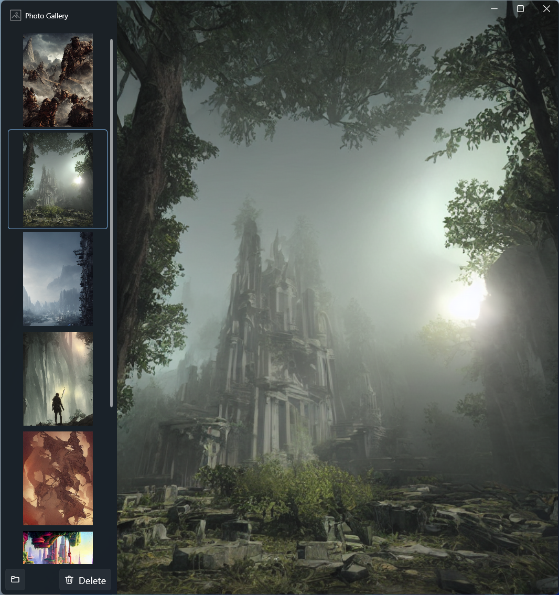

# Photo Gallery

The Photo Gallery is a lightweight and user-friendly application developed using WPF. It has been specifically designed to provide a convenient solution for managing and viewing AI-generated images while the generation process continues. As the generation process runs in the background, this application allows you to monitor a specified folder, providing a real-time gallery view of the images being produced. The Photo Gallery offers an effortless way to organize and explore your AI-generated image collection.

 
## Getting Started

To get started with the Photo Gallery app, follow these steps:

1. Set up your development environment with Visual Studio and .NET 7.
2. Clone the repository: git clone https://github.com/enginkirmaci/PhotoGallery.git.
3. Open the project in Visual Studio.
4. Build and run the application.
5. Specify the folder you want to monitor.
6. Enjoy the seamless gallery view and real-time updates of your images.

## Contributing

Contributions are welcome! If you find any bugs or have suggestions for new features, please open an issue or submit a pull request.

## License

This project is licensed under the [MIT License](LICENSE).
